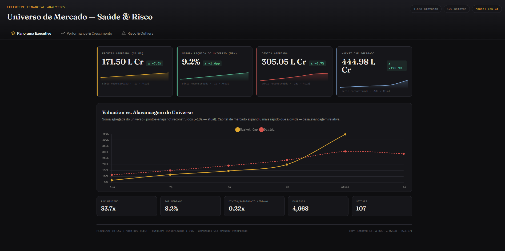

# 📊 Financial KPI Analytics Dashboard

---

## 🌐 Dashboard Online

https://callout84.github.io/financial-kpi-analytics-dashboard/

---

# 💼 Problema de Negócio

Este projeto foi desenvolvido com foco em análise financeira executiva utilizando visualização moderna de dados e storytelling analítico.

O objetivo foi transformar indicadores financeiros brutos em um dashboard interativo capaz de apoiar tomada de decisão estratégica, análise de risco e acompanhamento de performance corporativa.

O painel simula um ambiente real de Business Intelligence utilizado por áreas de:

- FP&A
- Controladoria
- Equity Research
- Risk Analytics
- Estratégia Corporativa

---

# 🎯 Objetivos do Projeto

- Construir um dashboard financeiro moderno para portfólio
- Demonstrar evolução prática em Data Science e Analytics
- Aplicar conceitos de análise executiva e visualização de dados
- Simular dashboards utilizados em ambientes corporativos
- Explorar uso de IA como acelerador de aprendizado e produtividade

---

# 📈 Principais Indicadores Analisados

- Receita Agregada (Sales)
- Margem Líquida (NPM)
- Dívida Agregada
- Market Cap
- P/E Mediano
- ROE Mediano
- Dívida/Patrimônio
- Crescimento histórico
- Performance do universo financeiro

---

# 🚨 Pontos de Atenção Identificados

- Expansão acelerada do valuation comparado ao crescimento operacional
- Crescimento da dívida em determinados períodos
- Possível desalavancagem relativa no cenário atual
- Forte dispersão entre empresas do mesmo setor
- Indicadores financeiros sensíveis a outliers

---

# 🧠 Insight Não-Óbvio

Mesmo com crescimento relevante do Market Cap agregado, parte do universo analisado apresenta desacoplamento entre valorização e eficiência operacional.

Isso sugere que o mercado pode estar precificando expectativa futura acima da geração real de resultado em determinados grupos de empresas.

---

# 🛠️ Tecnologias Utilizadas

- HTML5
- CSS3
- JavaScript
- Chart.js
- Tailwind CSS
- GitHub Pages

---

# 🎨 Features do Dashboard

- Interface executiva moderna
- Dark Mode
- KPIs interativos
- Visualização responsiva
- Storytelling analítico
- Indicadores financeiros dinâmicos
- Gráficos interativos
- Layout inspirado em plataformas enterprise analytics

---

# 🤖 Uso de Inteligência Artificial no Projeto

Este projeto foi desenvolvido durante meus estudos em Data Science na Alura.

Utilizei Inteligência Artificial como ferramenta de apoio para:

- estruturar dashboards executivos
- melhorar visualização de dados
- entender conceitos de analytics
- acelerar aprendizado prático
- evoluir arquitetura front-end
- refinar storytelling analítico

Todo o projeto foi estudado, ajustado e validado manualmente durante o processo de desenvolvimento.

---

# 📚 Jornada de Aprendizado

Atualmente estou em transição para a área de Data Science e Analytics.

Meus estudos são focados em:

- Python
- SQL
- Power BI
- Visualização de Dados
- Analytics
- Dashboards Executivos
- Business Intelligence

Este repositório faz parte da construção prática do meu portfólio profissional.

---

# 📌 Próximos Passos

- Integração com datasets reais
- Pipeline automatizado de dados
- KPIs temporais avançados
- Deploy em cloud
- APIs financeiras
- Modelos preditivos financeiros
- Dashboard conectado a banco SQL

---

# 🔗 Repositório

https://github.com/Callout84/financial-kpi-analytics-dashboard
